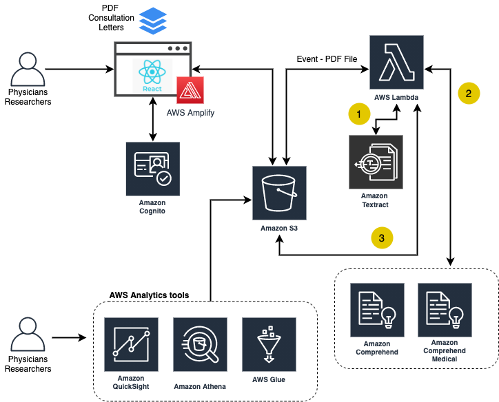

# IBD Centre
This prototype was created for IBD Centre's data processing and storage of a summary of patients
## Stack

* **Front-end** - ReactJS on NodeJS as the core framework, Amplify for Auth UI component and AWS integration.
* **Data** - All data is saved in Amazon S3 and DynamoDB for status
* **Auth** - Cognito user pool within AWS amplify
* **Data Processing** - Uses AWS Lambda function in the backend to execute Comprehend Medical API to classify information
 
## Architecture Diagram


# Frontend Deployment
[](https://console.aws.amazon.com/amplify/home#/deploy?repo=https://github.com/UBC-CIC/ibd-centre)

To deploy the frontend part of this application please follow:
1) Fork this repository
2) In a terminal from the project root directory, enter the following command (accept all defaults):
```javascript
amplify init
```
3) Next, after the Amplify project has been initialized, in your terminal again from the project root directory, enter the following command (accept all defaults and select "Yes" for all options):
```javascript
amplify push
```
4) Next, open a browser and go to the [Amplify Console](https://aws.amazon.com/amplify/console/) and select the app you just created.
5) Next, click on the "frontend environments" tab and select "Github" under the "Host a web app" section then click **Connect branch**.
6) Select the repository that contains the fork of this project. Click **Next**.
7) From the *Select a backend environment* dropdown, select *dev*.
8) Next, click on the **Create a new role** button and accept all defaults. Now click the refresh button and select the role you just created in the dropdown menu. Click **Next**.
9) Click **Save and deploy**.
10) Wait until Provision, Build, Deploy and Verify are all green.
11) From the Amplify console, navigate to __Backend environments__ -> __Storage__ and click on __View in S3__. We will be using this bucket later to connect to the Backend Lambda function. 
12) Navigate to AWS DynamoDB and find the table that Amplify created. It should start with Status. Copy that for the Backend as well. 

# Backend Deployment
Deploy the backend application onto AWS Lambda function.

**Build Instructions:**

This application requires the frontend Amplfy Application to be setup and running on the same account and region. 
1. Run the `create_lambda.bat` script for Windows machines or `create_lambda.sh` for Linux machines and follow the prompts 
2. The AWS Account ID can be found in the Account Settings in the Console. 
3. The DynamoDB table name can be found by searching DynamoDB and clicking on __Tables__. The corresponding table should start with _Status_. 
4. The region should be the same as the region you used to create the Amplify Application ie. ca-central-1. 
3. In the AWS console, navigate to the newly created lambda function
4. Click on the Add Trigger Option 

# Changelogs

# Updates
If you make any updates to `index.py`, you must run `lambda.sh` on a machine with the same OS as Python3.8 in AWS Lambda

# License 
