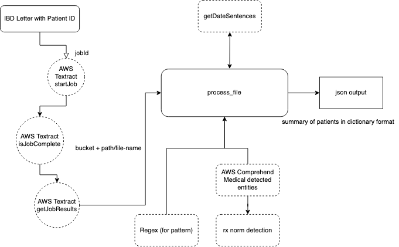

# Medical Letter Processing
This prototype was created for Specialist medical centres for data processing and storage for summary of patients

## Stack
* **Front-end** - ReactJS on NodeJS as the core framework, Amplify for Auth UI component and AWS integration.
* **Data** - All data is saved in Amazon S3 and DynamoDB for status
* **Auth** - Cognito user pool within AWS amplify
* **Data Processing** - Uses a Lambda function in the backend to execute Comprehend Medical API and Regex pattern to detect and categorize information 
 
## Architecture Diagram


## Requirements
Before you deploy, you must have the following installed:
*  [AWS Account](https://aws.amazon.com/account/) 
*  [GitHub Account](https://github.com/) 
*  [AWS CLI](https://aws.amazon.com/cli/) 
*  [SAM CLI](https://docs.aws.amazon.com/serverless-application-model/latest/developerguide/serverless-sam-cli-install.html) 
*  [Amplify CLI installed and configured](https://aws-amplify.github.io/docs/cli-toolchain/quickstart#quickstart) 

## Deployment
The overall deployment of this prototype can be split in 3 parts.

### Frontend deployment

[](https://console.aws.amazon.com/amplify/home#/deploy?repo=https://github.com/UBC-CIC/ibd-centre)

This will start the deployment on your Amplify console, like this:

Make sure to add the role and then click save and deploy. While Amplify forks and connects the repo, wait until Provision, Build, Deploy and Verify indicators are all green.

### Backend Deployment
After creating the frontend, the backend of this application can be deployed onto your AWS account with the following steps:

1. Run `deploy_lambda.sh` or `deploy_lambda.bat` (for Windows), confirm that the bucket and dynamodb name are same as the one made by Amplify's one touch deployment and then wait for sam to deploy.
```
Build Succeeded

Built Artifacts  : .aws-sam/build
Built Template   : .aws-sam/build/template.yaml

Commands you can use next
=========================
[*] Invoke Function: sam local invoke
[*] Deploy: sam deploy --guided
    
Uploading to 229c82469c86e69af9476979b3b974a6  5147523 / 5147523  (100.00%)

Successfully packaged artifacts and wrote output template to file out.yaml.
```
2. Here is an example output when running SAM
```
Configuring SAM deploy
======================

        Looking for config file [samconfig.toml] :  Not found

        Setting default arguments for 'sam deploy'
        =========================================
        Stack Name [ibd-lambda]: 
        AWS Region [ca-central-1]: 
        Parameter s3Bucket [ibdcentreb3cbdd9c0c2a495498c88bf5c73a4aeadevx-devx]: 
        Parameter DynamoDbTable [Status-lanxzcxbyfd43a6tmisz6ghk4m-devx]: 
        #Shows you resources changes to be deployed and require a 'Y' to initiate deploy
        Confirm changes before deploy [y/N]: y
        #SAM needs permission to be able to create roles to connect to the resources in your template
        Allow SAM CLI IAM role creation [Y/n]: y
The resource AWS::Serverless::Function 'PdfToJson' has specified S3 location for CodeUri. It will not be built and SAM CLI does not support invoking it locally.
        Save arguments to configuration file [Y/n]: y
        SAM configuration file [samconfig.toml]: 
        SAM configuration environment [default]: 
```

3. Next, check whether changeset is creeated by CloudFormation. It should add Permission, Alias, Role, Version, Function and Parameter resources. It will automatically build these resources in the cloud once you see:
```
Successfully created/updated stack - ibd-lambda in ca-central-1
```

Go back to your AWS console in Amplify, once frontend deployment is successful, you can now login, make an account and upload/process patient letters.

### Athena set up
1. Run `setup_athena.sh` or `setup_athena.bat` script, it will ask you for bucket name again and you can paste the same one. 
2. Go to your aws account management console, search for Athena to find the newly made tables.

### Backend logic
Here is a flow diagram on how the index.py works:


### Manual Deployment
1. If the one touch deployment doesn't work, you can follow this [Deployment Guide](docs/deployment_guide1.md) to set up the frontend of this application.

2. You can follow [this](docs/deployment_guide2.md) (more extensive guide) showing how index.py works, steps to deploy the backend lambda, add trigger, set up Athena, and how to check Cloudwatch logs

## Change logs

## License 
This project is distributed under the [MIT License](https://github.com/UBC-CIC/ibd-centre/blob/main/LICENSE)
