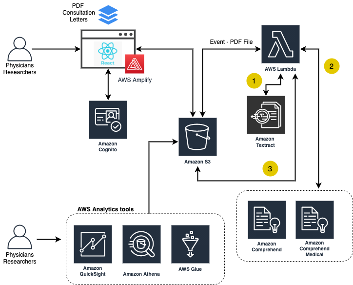

# IBD Centre
This prototype was created for IBD Centre's data processing and storage of a summary of patients

## Stack
* **Front-end** - ReactJS on NodeJS as the core framework, Amplify for Auth UI component and AWS integration.
* **Data** - All data is saved in Amazon S3 and DynamoDB for status
* **Auth** - Cognito user pool within AWS amplify
* **Data Processing** - Uses a Lambda function in the backend to execute Comprehend Medical API and Regex pattern to detect and categorize information 
 
## Architecture Diagram

## Requirements
Before you deploy, you must have the following installed:
*  [AWS Account](https://aws.amazon.com/account/) 
*  [GitHub Account](https://github.com/) 
*  [AWS CLI](https://aws.amazon.com/cli/) 
*  [SAM CLI](https://docs.aws.amazon.com/serverless-application-model/latest/developerguide/serverless-sam-cli-install.html) 
*  [Amplify CLI installed and configured](https://aws-amplify.github.io/docs/cli-toolchain/quickstart#quickstart) 

## Deployment
The overall deployment of this prototype can be split in 3 parts.

1. **Clone** and **Fork** this solution repository.
2. Follow the [Deployment Guide](docs/deployment_guide1.md) to set up the frontend of this application.

3. Next, you can follow this [Deployment Guide](docs/deployment_guide2.md) showing steps to deploy the backend lambda, add trigger, set up Athena, and how to check Cloudwatch logs

## Cloudformation 
1. Cloudformation deployment works once you run the lambda script locally (successfully completing the previous two steps). This [guide](docs/deployment_guide3.md) shows how to deploy using cloudformation and Amplify's one touch deployment.

## Change logs

## License 
This project is distributed under the [MIT License](https://github.com/UBC-CIC/ibd-centre/blob/main/LICENSE)
