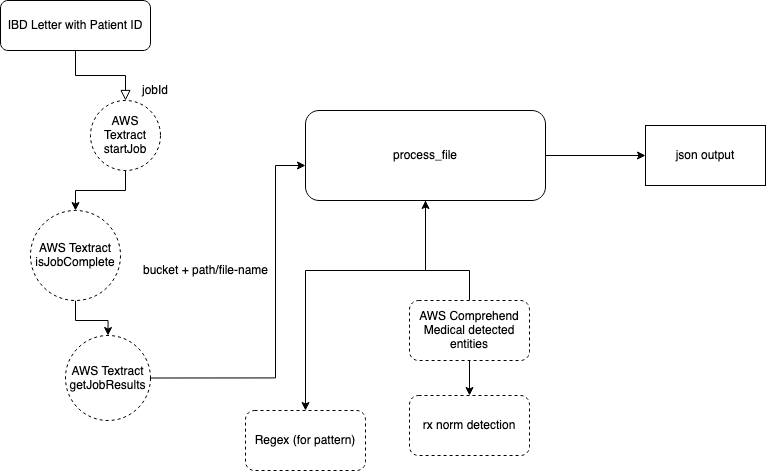

# Requirements
Before you deploy, you must have the following in place:
*  [AWS Account](https://aws.amazon.com/account/) 
*  [GitHub Account](https://github.com/) 
*  [Node 10 or greater](https://nodejs.org/en/download/) 
*  [Amplify CLI 4.13.1 or greater installed and configured](https://aws-amplify.github.io/docs/cli-toolchain/quickstart#quickstart) 

## Backend Architeture
