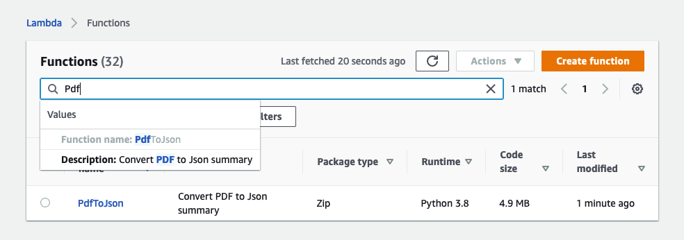
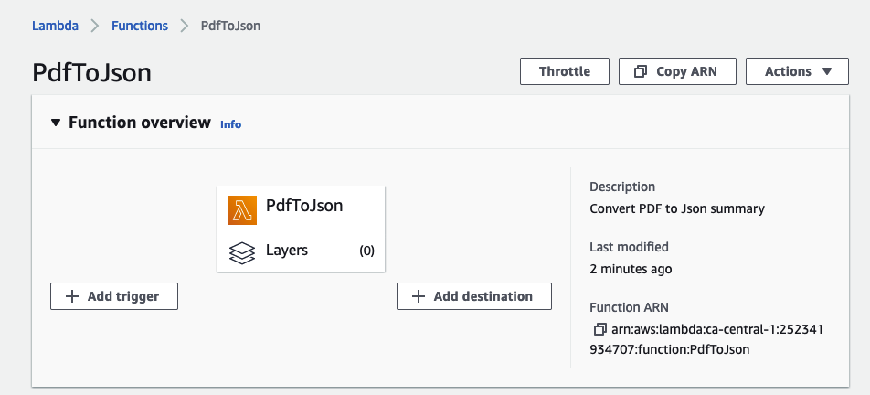
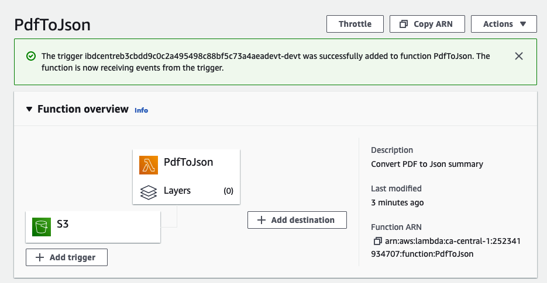
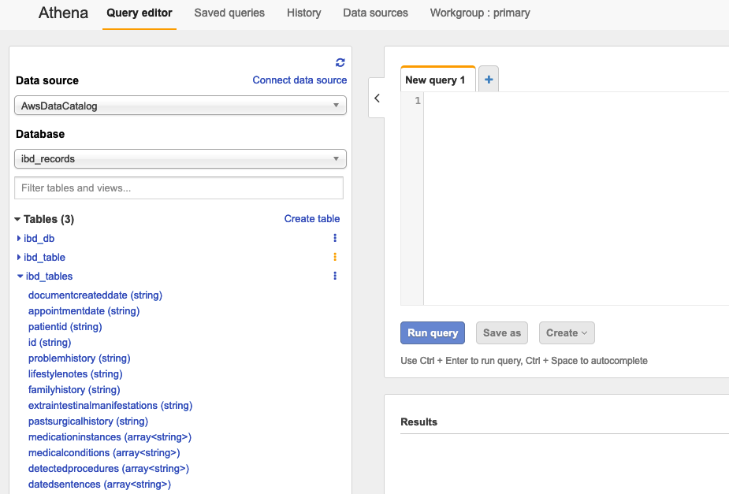
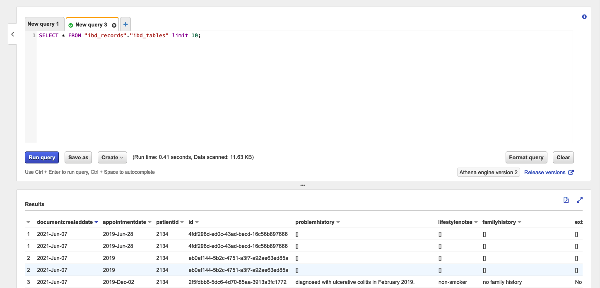
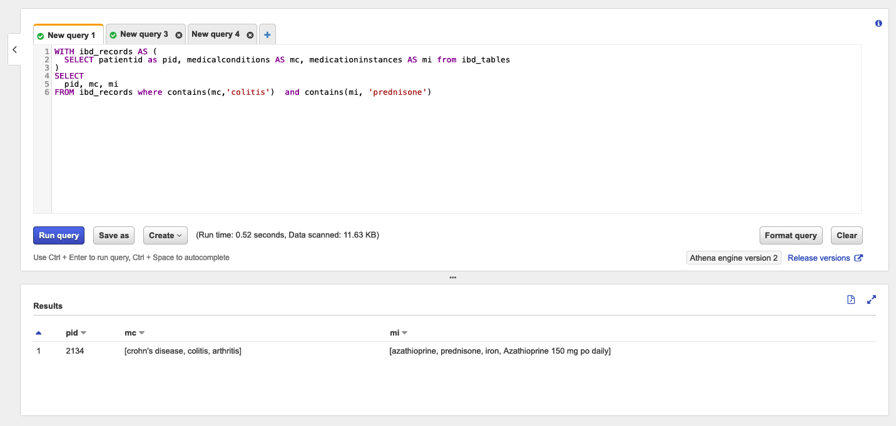
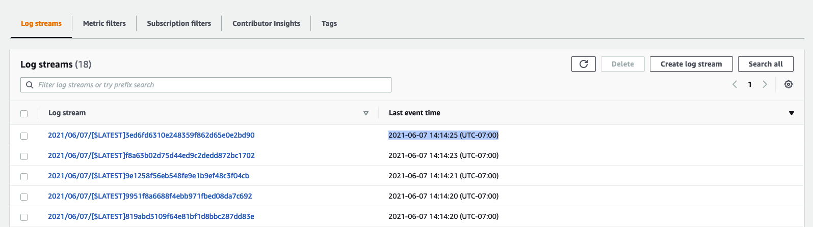
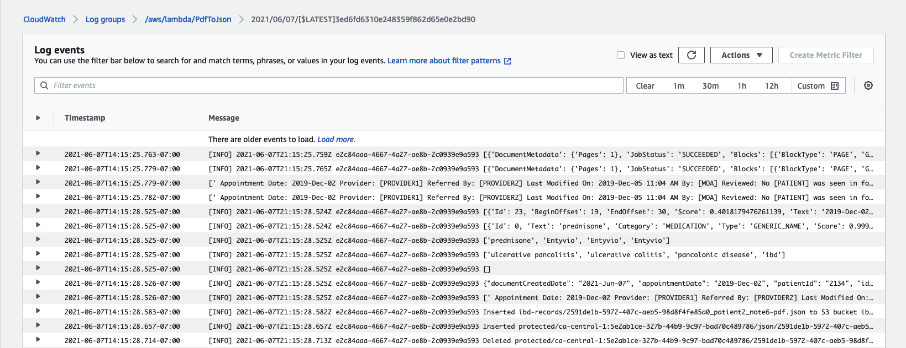

## Backend deployment steps

1. Go back to your terminal and enter the backend folder. Next, run the following script to locally run the lambda (depending on your Linux or Windows):
```bash
create_lambda.sh | create_lambda.bat
```
a. The script asks for your AWS Account Id, Lambda name (PdfToJson), DynamoDB name (dynamodb-ibd), and region (ca-central-1)
b. Deletes existing roles and attached policies (if any)
c. Creates them again and packages and zips the first version of lambda script.

2. You can confirm whether the function is made by going to the AWS Console and searching for Lambda.

You may need to search it.
3. Next, click on add trigger and connect it with the branch created by Amplify


4. You can see it connect like this:



Finally, you should see the same bucket with lambda trigger attached when going to File storage in Amplify project in your AWS console.

5. Optionally, if you make any changes to the lambda script (index.py), run the following command to update it through CLI
```bash
lambda.sh | lambda.bat
```

This concludes building the main stack of the project. Once you follow the steps outlined and wait for the Amplify project to finish building, you can now create users, upload a file, and process them using the URL. Once you're finished with a set of files, you can proceed to next steps for queries

## To set up the AWS Analytics tools
1. Run the following script in your terminal root directory of this project
```bash
setup_athena.sh | setup_athena.bat
```
Make sure to rename the table names or schema if you append the details of them.

2. Check whether the table is created on your AWS console by going to athena:


3. You can now run additional queries like these and gather patient letters with their summaries.
For listing the records,

You can also modify it to search within a string like this:


## Cloudwatch logs
Moreover you can see the files get processed in real time 
1. Search Cloudwatch on your AWS Console and click on the PdfToJson lambda

2. Next, you can select for the latest log file

3. You can now see the log events (calls made by the lambda script) on your console for debugging 
