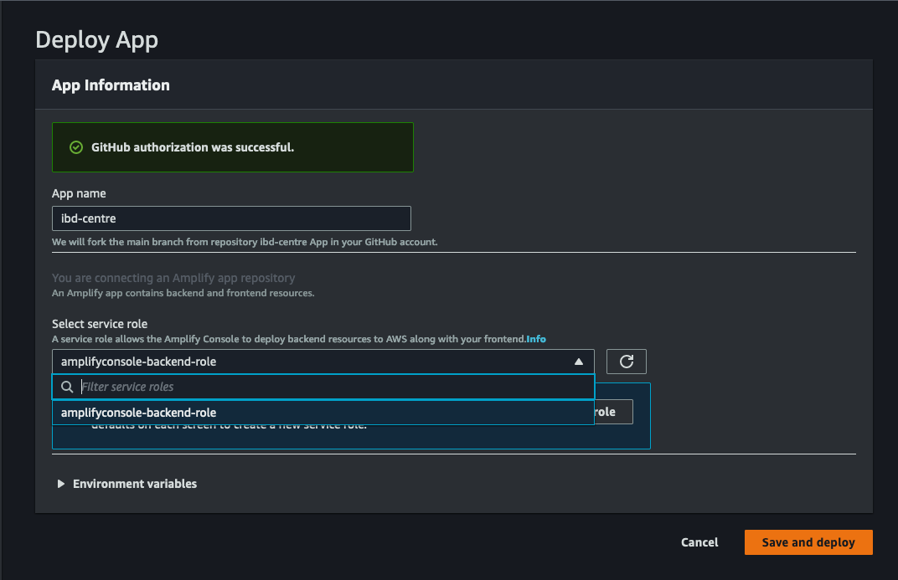

### 1. Frontend deployment

This will start the deployment on your Amplify console, like this:

Make sure to add the role and then click save and deploy.

### 2. Backend Deployment
Deploying the backend application onto your AWS account requires the following steps:

1. Run `deploy_lambda.sh`, confirm the bucket and dynamodb name are same as the ones with one touch deployment and then wait for sam to deploy.
2. Confirm that the names are correct for project name, s3 bucket, dynamodb, and the lambda arn.
3. Click yes to options that pop up.
4. On your AWS console in Amplify, once frontend deployment is successful, you can now login, make an account and upload/process the letters.

### 3. AWS Athena set up

1. Run `setup_athena.sh`, it will ask you for bucket name again and you can paste the same one. 
2. Go to your aws account management console, search for Athena to find the newly made tables.